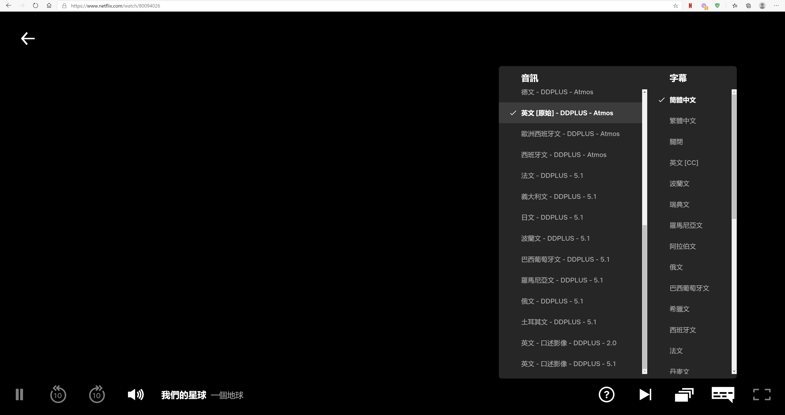

thanks to https://github.com/truedread/netflix-1080p

**My modified version can only work on Windows 10 64-bit, MicrosoftEdge(Chromium core)**

*This extension of MicrosoftEdge (Chromium core) implements the following function*  

1, MAX 4K  https://help.netflix.com/zh-tw/node/13444   
2, DDplus audio 
3, all languages (audio and sub,if any)  
    
    
Recommended software: Win10.Ver.2004,MsEdge>V81(In non-win10 or portable version, WidevineCdm will be used, its = Chrome)  
If you must use the portable version, please use V79, but no HDR.  
    
    
ATMOS is very, very amazing  
https://www.netflix.com/search?q=ATMOS  
enjoy
    
    
-------------------------------------------------------------------------------------------------------
     

