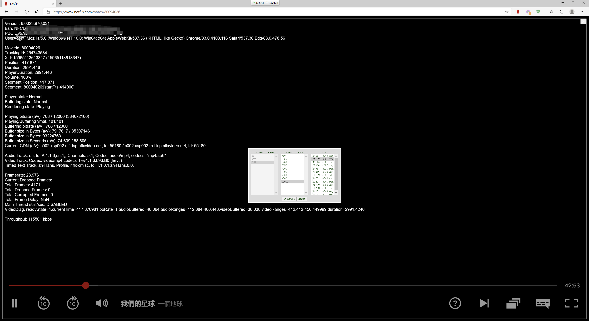
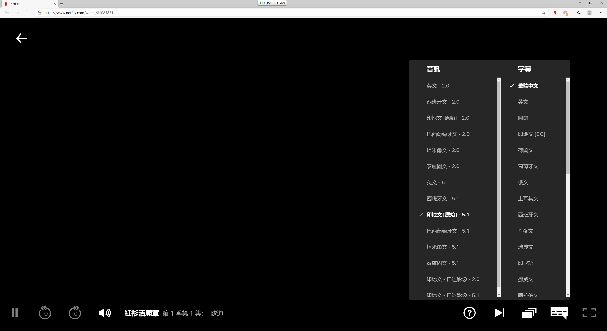

thanks to https://github.com/truedread/netflix-1080p

Microsoft Store:  
https://microsoftedge.microsoft.com/addons/detail/oikpkeeoofpiapmjioabikmgjeaoggcn

**My modified version can only work on Windows 10 64-bit, MicrosoftEdge(Chromium core)**

**Features (See Options)**  
1, MAX 4K  https://help.netflix.com/zh-tw/node/13444   
2, DDplus, Atmos(if any) Audio   
3, all languages (audio and sub,if any)  
4, Use AVC, NOT AvcHigh video code    
5, Automatically select best bitrate available  
6, Use "Dolby Vision" Profiles for HDR (May need NVIDIA 20 series and above graphics cards, and Dolby Vision TV)
  
  
  
Recommended software:   
1,Win10.Ver.2004  
2,MsEdge>V81(In non-win10 or portable version, WidevineCdm will be used, its = Chrome)  

    
    
ATMOS is very, very amazing  
https://www.netflix.com/search?q=ATMOS  
enjoy
    
    
-------------------------------------------------------------------------------------------------------
     

